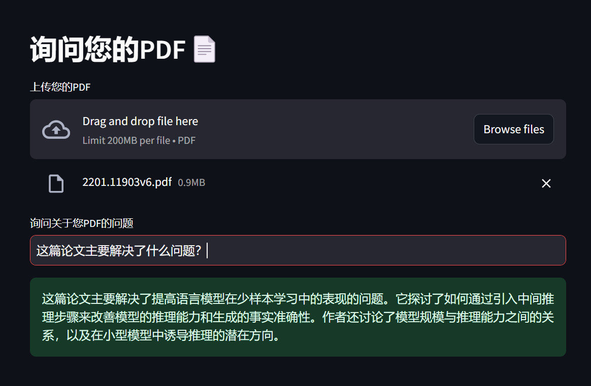

# pdf.llm

## About the Project

**pdf.llm** is a simple tool to ask questions about your PDF.

This is a fork of [DocGenius-Revolutionizing-PDFs-with-AI](https://github.com/KalyanM45/DocGenius-Revolutionizing-PDFs-with-AI), which seems to lack maintainance and be outdated. So I decided to rewrite it.



##  Installation 

After cloning the repository, install the required libraries:
 
```sh
pip install -r requirements.txt
```

And makesure you config your openai api key or base url correctly (in .env file or environment variables).

## Usage

```sh
streamlit run app.py
```
